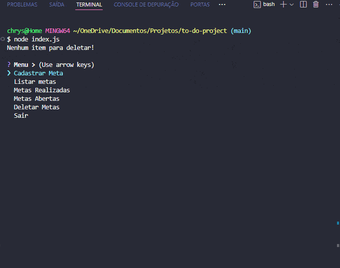

<h1 align="center"> To-Do List via Terminal </h1> 

Projeto de Controle de Metas via terminal

  
  <a href="#-technologies">Technologies</a>&nbsp;&nbsp;&nbsp;|&nbsp;&nbsp;&nbsp;
  <a href="#-features">Features</a>&nbsp;&nbsp;&nbsp;|&nbsp;&nbsp;&nbsp;
  <a href="#-project">Project</a>&nbsp;&nbsp;&nbsp;|&nbsp;&nbsp;&nbsp;
  <a href="#-how-to-run">How to Run</a>&nbsp;&nbsp;&nbsp;|&nbsp;&nbsp;&nbsp;
  <a href="#-license">License</a>&nbsp;&nbsp;&nbsp;|&nbsp;&nbsp;&nbsp;
  <a href="#-contributing">Contributing</a>&nbsp;&nbsp;&nbsp;|&nbsp;&nbsp;&nbsp;
  <a href="#support">Support</a>  

  

  

 

## 🛠 Technologies

- JavaScript;
- Node;
- JSON;
- Git e GitHub.

 

## ✨ Features

- [X] Create goals
- [X] List goals
- [X] View completed goals
- [X] View open goals
- [X] Mark/Unmark goals as completed
- [X] Remove goals
- [X] Messaging system
- [X] Persist data
- [X] Asynchronous Functions (async/await)
- [X] Module Import (require, CommonJS)
- [X] "Inquirer" Library for Creating Interactive Prompts
- [X] FS (File System)

 

## 💻 Project

- The website was created to practice JavaScript, Node and JSON skills.

 

## ⚙ How to Run

- You need to have <kbd>[NodeJS](https://nodejs.org/en/download/)</kbd> installed on your machine.
- Clone the project.
- Open the terminal and run <kbd>npm install</kbd>.
- After installation, run <kbd>node index.js</kbd>.

 

## 📜 License

* This project is licensed under the [MIT License](https://choosealicense.com/licenses/mit/)

 

## 🫱🏻‍🫲🏻 Contributing

 Contributions, issues, and feature requests are welcome! Please, feel free to do it! 😉 

 

## 🌟 Support

 If you like this project, please give it a star ⭠and share it with others! 😄 

